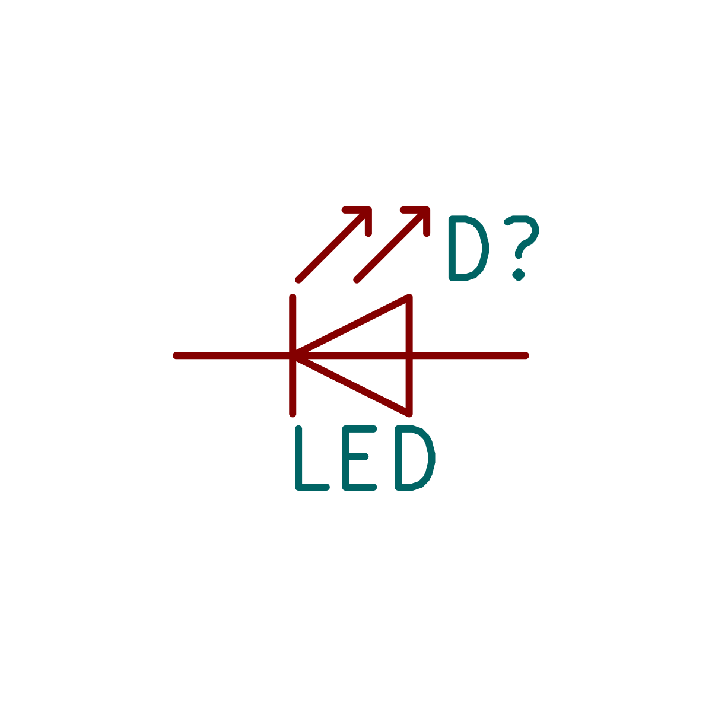
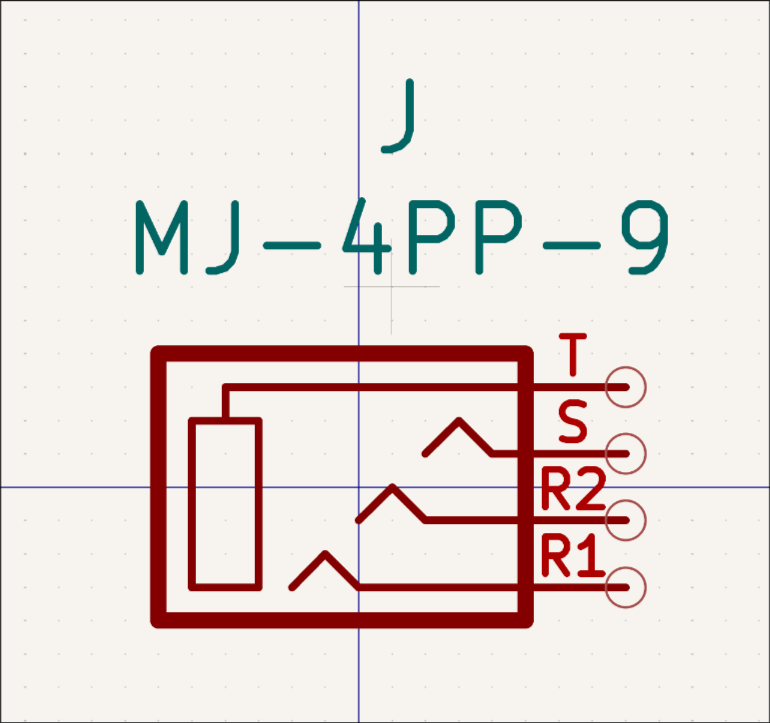
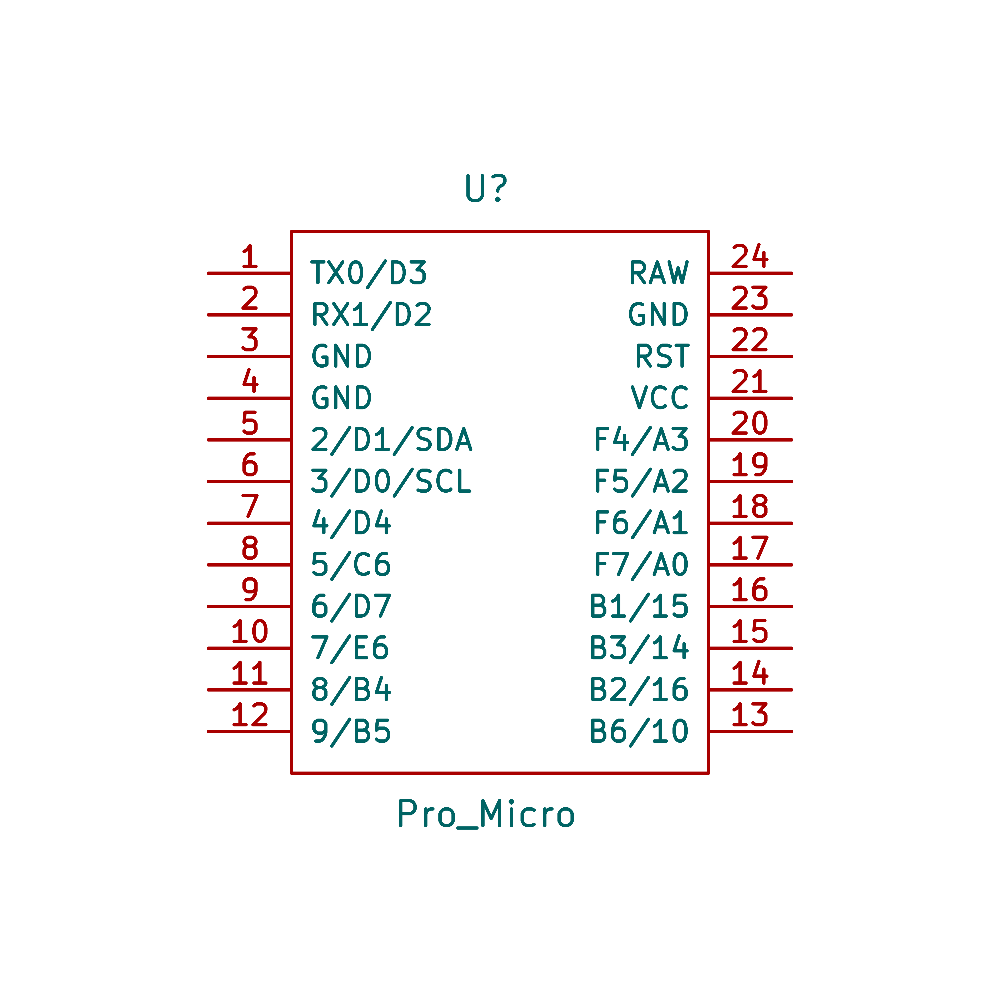
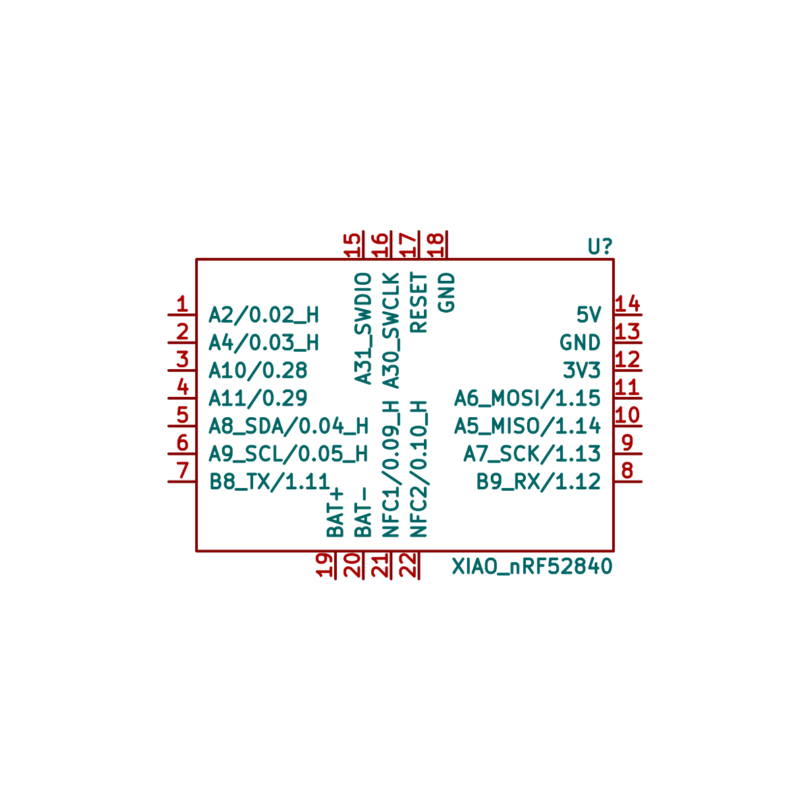
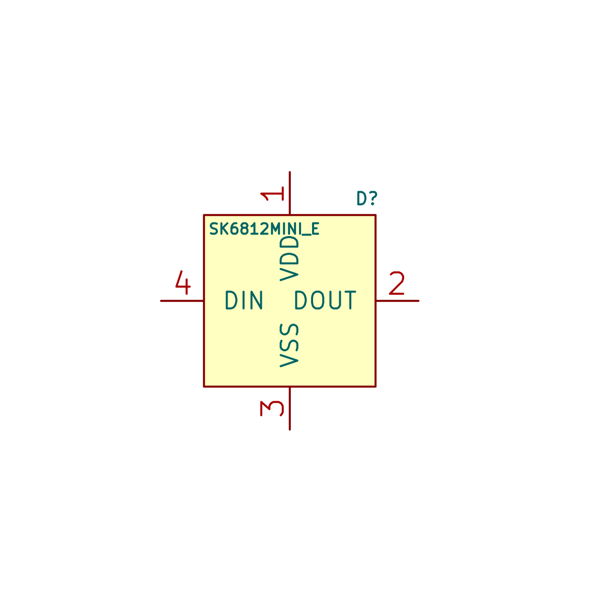

# Inpulib

This repository is a **DIY Mechanical Keyboard KiCad Library** created for hobbyists, custom keyboard builders, and electronics designers.
It provides a complete set of **schematic symbols** and **footprint libraries** for designing mechanical keyboard PCBs in KiCad.

The library covers the most commonly used components in keyboard design:

* **Switches** – MX, Kailh Choc, Alps, and other profiles
* **Momentary buttons, rotary encoders, and toggle switches** – for matrix inputs, settings, and on/off control
* **Controllers** – Pro Micro and other compatible boards
* **Connectors** – for OLED displays, battery connections, TRRS/Audio jacks, and other peripherals
* **Diodes & Resistors** – standard components for matrix wiring and signal conditioning
* **LEDs** – including generic and addressable RGB

With these libraries, you can quickly integrate standard parts into your schematic and PCB layout, saving time and ensuring compatibility with popular keyboard components.

## Footprint

### Swtiches pretty

Name   | Description/notes| Preview  |
------------------------|--------------------------------------------|-------------------------------
SW_Alps_TH | Alps/Matias, through hole | 
SW_B3G-S_TH | B3G-S, through hole | 
SW_CPG1316 | CPG1316, smd, one side | 
SW_CPG1316_Reversible | CPG1316, smd, reversible | 
SW_Choc_Mini_TH | Choc Mini, through hole, one side | 
SW_Choc_V1V2_HS | Choc V1/2, hot-swap, one side | 
SW_Choc_V1V2_HS_Reversible | Choc V1/2, hot-swap, one side | 
SW_Choc_V1V2_TH | Choc V1/2, through hole, one side | 
SW_Choc_V1V2_TH_Reversible | Choc V1/2, through hole, reversible | 
SW_Hi-Tek_725_TH | Hi-Tek 725, through hole | 
SW_KS-27KS-33_HS | KS-27/33, hot-swap | 
SW_KS-27KS-33_HS_Reversible | KS-27/33, hot-swap, reversible | 
SW_KS-27KS-33_TH | KS-27/33, through hole | 
SW_KS-27KS-33_TH_Reversible | KS-27/33, through hole, reversible | 
SW_MX_HS | MX, hot-swap, one side | 
SW_MX_HS_Reversible | MX, hot-swap, reversible | 
SW_MX_TH | MX, through hole, one side | 
SW_MX_TH_Reversible | MX, through hole, reversible | 

### Buttons pretty

Name   | Description/notes| Preview  |
------------------------|--------------------------------------------|-------------------------------
SW_SMD_EVQP7C01K | SPST, SMD, 4 pin, 3.5x2.9x1.35 mm | 
SW_SMD_L4_W3_H1.5 | SPST, SMD, 2 pin, 4x3x1.5 mm| 
SW_SMD_MSK12C02 | SPDT, SMD, 7 pin, 6.6x2.7x1.4 mm | 
SW_SMD_TS-1289VE-4 | SPST, SMD, 4 pin, 3.5x4.7x1.6 mm | 
SW_TH_1TS002A | SPDT, through hole, 2 pin, 6x3.5x4.3 mm | 
SW_TH_BSI-10H | SPDT, through hole, horizontal, 3 pin, 10x2.5x5.9 mm | 
SW_TH_EC11E | Encoder, through hole | 
SW_TH_SKHLLBA010 | SPDT, through hole, horizontal, 3 pin, 7.3x3.6x4.3 mm | 

## Symbols

Name   | Description/notes| Preview  |
------------------------|--------------------------------------------|-------------------------------
D_1N4448 | Diode 1N4448, DO-35 package |  
D_1N4448W | Diode 1N4448W, SOD-123 package |    
D_1N4448WS | Diode 1N4448WS, SOD-323 package |  
Conn_01x04 | Generic connector, 4-pin, for OLED display | 
Conn_01x05 | Connector, 5-pin, for Nice!View OLED display | 
SW_Encoder_EC11| Rotary encoder EC11, 5-pin, with built-in push button | 
GND | Global ground symbol | 
LED_Generic| Generic LED, 2-pin, through-hole or surface mount | 
Jack_Audio_MJ4PP9 | 4-pin connector for split keyboard halves cable with jack | 
Board_ProMicro | Microcontroller dev board compatible with Nice!Nano, Super Mini NRF, Arduino Pro Micro, Elite-C, RP2040 Pro Micro | 
Board_XIAO_nRF52840 | Microcontroller dev board Seeed Studio XIAO nRF52840 | 
PWR_Flag | Power source flag for ERC | 
R_Generic | Generic resistor, 2-pin, through-hole or surface mount | 
SW_Push | Push button switch, 2-pin, keyboard matrix or tactile | 
SW_Push_45deg | Push button switch, 2-pin, rotated 45°, keyboard matrix or tactile | 
SW_SPDT | Single pole double throw (SPDT) on/off switch, 3-pin | 
LED_Addressable_SK6812MINI-E | Addressable RGB LED, 3.2x2.8x1.78mm | 
